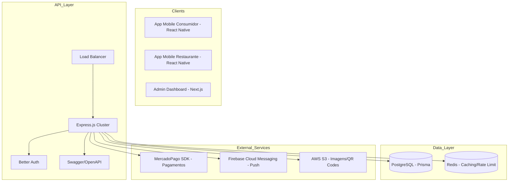

# ♻️ Food Surplus - Plataforma Enterprise de Combate ao Desperdício

O **Food Surplus** é um ecossistema robusto projetado para mitigar o desperdício alimentar através de um marketplace dinâmico que conecta excedentes de produção a consumidores finais. Esta documentação detalha a arquitetura, as decisões técnicas e o roadmap de escalabilidade do núcleo (Backend).

---

## 🏗️ Arquitetura de Microserviços e Fluxo de Dados

O backend atua como o **Orquestrador Central**, gerenciando transações financeiras, persistência geolocalizada e comunicação em tempo real.

### Diagrama de Sistema de Alto Nível

---

## 🔐 Autenticação e Segurança (Better Auth)

O sistema utiliza **Better Auth**, uma solução de nível industrial para gestão de identidade.

-   **Prisma Adapter:** Integração nativa com nossas tabelas, gerenciando sessões, refresh tokens e segurança CSRF automaticamente.
-   **Multi-Role Mapping:**
    -   `RESTAURANT`: Identificado via metadados de sessão.
    -   `CONSUMER`: Perfil focado em histórico de compras.
-   **Segurança Avançada:** Implementação de hooks para validação de `isApproved` direto no ciclo de vida da autenticação.

---

## 📊 Modelagem de Dados e Business Intelligence

Para um dev sênior, a estrutura de dados é o que define a escalabilidade:

### Entidades Core:
-   **Offer (Ofertas):** Gerencia janelas de retirada (RN-01) e níveis de estoque em tempo real.
-   **Order (Pedidos):** Mantém a imutabilidade do preço no momento da compra (Snapshotting).
-   **Transaction (Financeiro):** Rastreia o `PlatformFee` (15%) e o `RestaurantAmount` (85%), garantindo integridade para conciliação bancária.

### Fluxo de Pagamento (Idempotência):
Integramos Webhooks do MercadoPago com validação de assinatura para garantir que um pedido só mude para `CONFIRMED` após a confirmação de liquidação real.

---

## 📉 Estratégias de Escalabilidade (Enterprise Ready)

Para suportar picos de tráfego durante o horário de fechamento dos restaurantes:

1.  **Geoportal Caching:** Uso de Redis para cachear resultados de `listOffers` baseados em quadrantes de latitude/longitude.
2.  **Jobs Assíncronos:** Processamento de expiração de ofertas fáceis e penalização de "No-Show" via BullMQ/Redis em background.
3.  **Circuit Breaker:** Implementação de padrões de resiliência nas chamadas ao gateway de pagamento.

---

## ☁️ Infraestrutura e Cloud

O sistema é projetado para rodar de forma distribuída:
-   **Containerização:** Docker + Kubernetes para orquestração de pods.
-   **CDN:** Uso de CloudFront para entrega de assets estáticos e imagens dos produtos.
-   **CI/CD:** Pipelines automatizados via GitHub Actions com verificação de Lint, Testes e Segurança (Snyk).

---

## 🧪 Quality Assurance (QA)

Nossa estratégia de testes cobre:
-   **Unitários:** Lógica de cálculo de taxas e descontos (Jest).
-   **Integração:** Fluxo de autenticação e persistência no banco.
-   **E2E:** Simulação de fluxos completos de compra e checkout.

---

## 🛠️ Stack Técnica Detalhada

-   **Runtime:** Node.js v22.x (NVM use 22)
-   **Linguagem:** TypeScript with Strict Mode
-   **ORM:** Prisma (Client & Engine)
-   **Validação:** Zod (Parse don't validate)
-   **Documentação:** Swagger UI + Specification Detail
-   **Auth:** Better Auth + Prisma Adapter

---

## 📖 Documentação de Rotas e API

Para uma visão técnica granular de cada endpoint, consulte:

1.  **[API Specification Detail](file:///c:/Users/Edilson%20Cuambe/Documents/desperdicio/docs/api-specification.md):** Payload estruturado, códigos de erro e exemplos.
2.  **[Authentication Flow Guide](file:///c:/Users/Edilson%20Cuambe/Documents/desperdicio/docs/authentication-flow.md):** Guia detalhado do sistema de autenticação Better Auth e registro de perfis.
3.  **[Swagger UI](http://localhost:3000/api-docs):** Documentação viva e interativa com suporte nativo a Better Auth.

---

## 🚀 Roadmap de Evolução

-   [ ] **Melhoria 01:** Implementar ElasticSearch ou Algolia para busca avançada de produtos.
-   [ ] **Melhoria 02:** Dashboards em tempo real com WebSocket para avisar restaurantes de novos pedidos sem delay.
-   [ ] **Melhoria 03:** Auditoria de Logs (Audit Trail) para todas as transações financeiras.

---
**Food Surplus v1.2.0** - Sustentabilidade através da Tecnologia.
